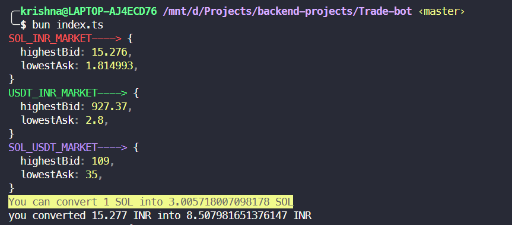

# Solana-Trade-bot

## Preface

This is Crypto trade bot. It makes you profit due the difference in highly liquid markets of **Solana, USD, INR** currency.
It uses the **COINDCX** APIs for asset trading and placing and cancelling Orders.

## Dependecies

-   Used **Bun.js** for lightning speed data transfer to place and cancel orders
-   Used **CoinDCX** APIs To get Highest and lowest Bids for current market and lets you decide buy stocks.

## Sample



## Local Enviormrnt setup:

You Need to run it on WSL/Linux since no official stable release of Bun for windows.

Copy the API key and secret:

```bash
cp config.example config.ts
```

Install Dependencies:

```bash
bun install
```

To run:

```bash
bun run index.ts
```

This project was created using `bun init` in bun v1.0.23. [Bun](https://bun.sh) is a fast all-in-one JavaScript runtime.
